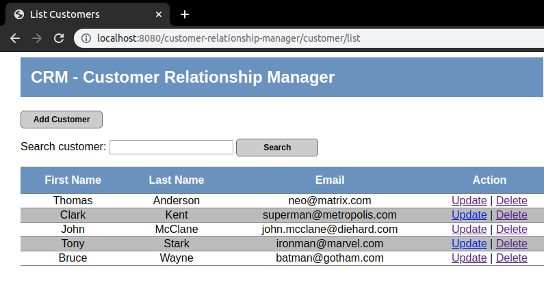
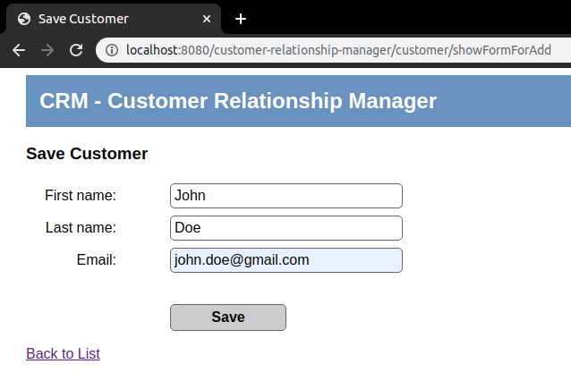
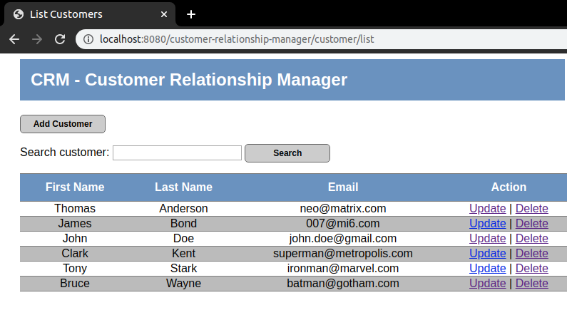
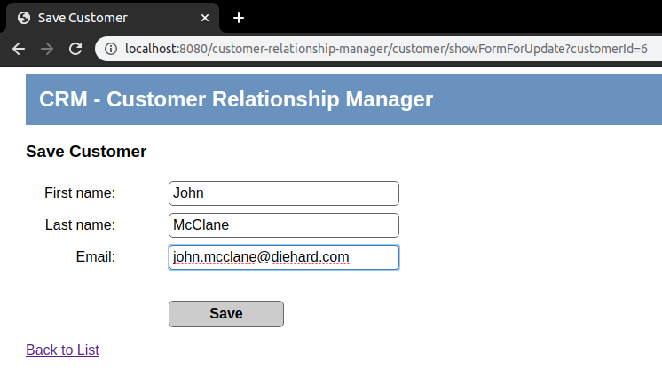
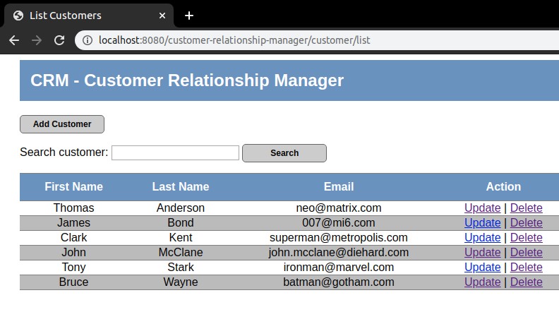
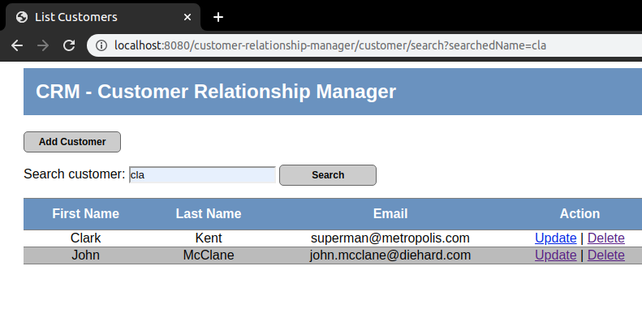
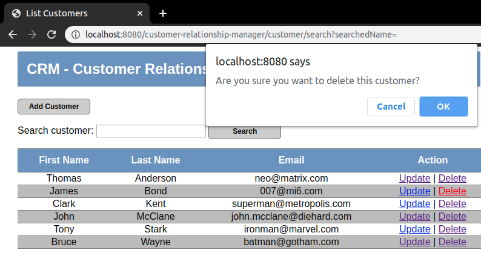
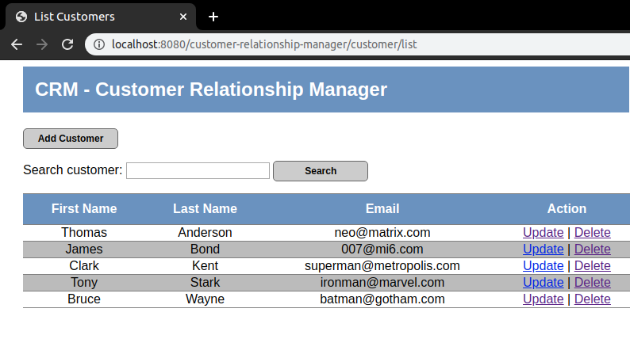
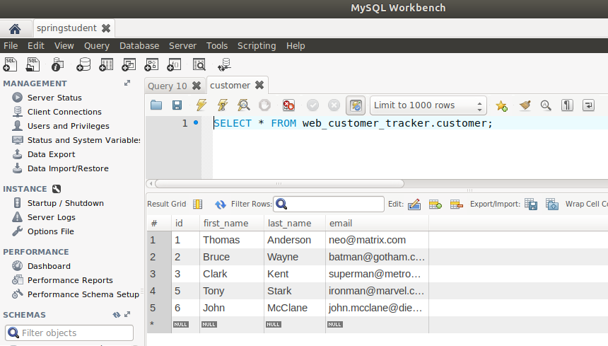

# Customer Relationship Manager
> Simple Database Web App for managing customers - Spring MVC and Hibernate Project

 

### Application features

- #### Adding a new customer
> By clicking the "__Add Customer__" button a user is redirected to a blank customer form, where the data for a new customer can be added.

 

> Clicking the "__Save__" button adds the filled in data to the database. 

 

- #### Updating a customer
> Data for any existing customer can be changed by clicking "__Update__". This link redirects to customer form which is already prepopulated with current data.
> Data in any form field can be changed.

 

> Clicking the "__Save__" button updates the data on the customer list and in the database. 

- #### Searching through the list of customers
> A list can be searched through for a specific customer by first name or last name. Search input is case insensitive and can contain any number of signs. 
> Searching with empty input field goes back to the full list of customers.

 

- #### Deleting a customer
> Any customer can be removed by clicking "__Delete__". When trying to delete a customer, user gets a question prompt popup. 

  
> After approval, the customer is removed from the list and the database.

 
 
- #### Managing all the data in MySQL database
> All the data from the app is stored in MySQL database.

 

### Technologies
* Java SE 11
* Spring 5.2.2
* Hibernate 5.4.10
* MySQL 8.0.18
* Javax Servlet API 4.0.1
* JSP 2.3.3
* JSTL 1.2
* Tomcat 9.0.29
* Maven 3.6.0
* HTML5
* CSS3

 

 

